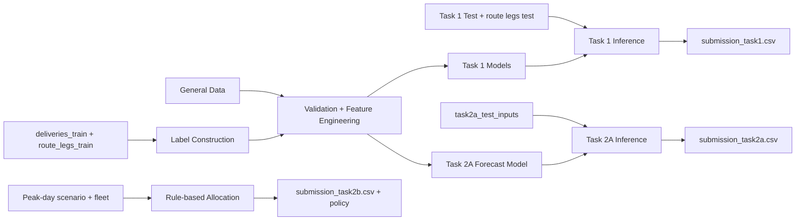
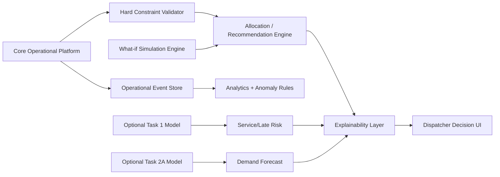
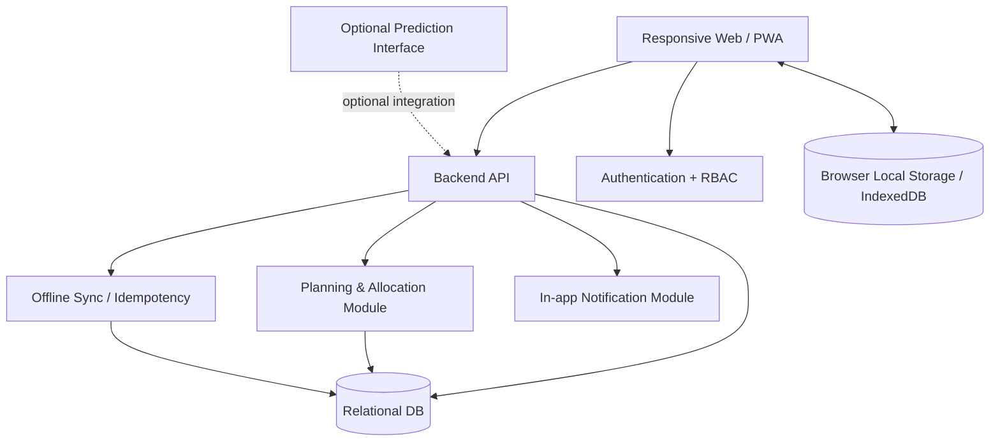
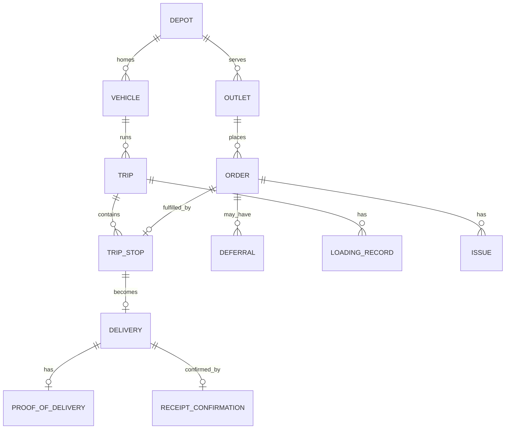
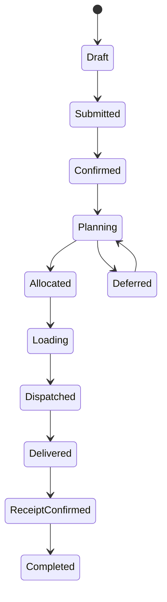
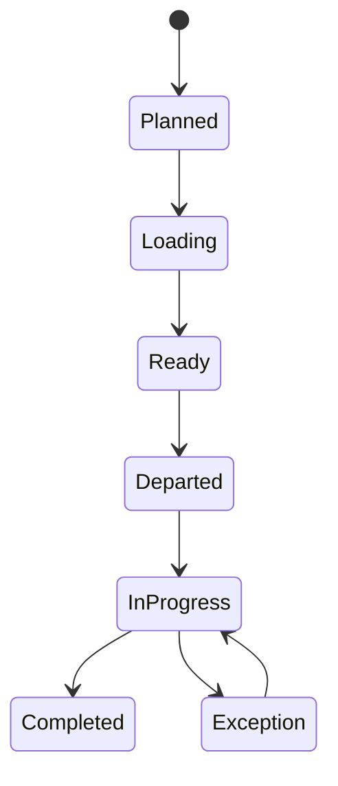
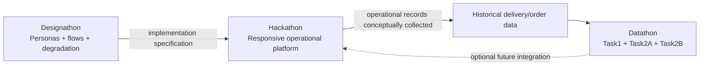

# SOFTWARE REQUIREMENTS SPECIFICATION

Waypoint Delivery Planning & Operations Platform

Tech-Triathlon 2026 - Designathon, Hackathon & Datathon

| Document | Value |
| --- | --- |
| Version | 1.0 |
| Date | 25 September 2026 |
| Status | Competition Engineering Baseline |
| Primary source | Official Tech-Triathlon 2026 Challenge Booklet |
| System scope | Ordering → planning → allocation → loading → delivery → receipt → analytics/prediction |
| Requirement source tags | [B] Booklet explicit; [D] logically derived; [P] proposed/optional; [A] assumption requiring validation |

This SRS intentionally separates product requirements from competition deliverables. Where the booklet is silent, the document marks the item as derived, proposed, or an assumption rather than presenting it as an official rule.

## 1. Document Control

| Field | Detail |
| --- | --- |
| Document owner | Team participating in Tech-Triathlon 2026 |
| Baseline | Day 1 challenge release |
| Change control | Significant departures from the Day 5 Designathon design must be documented in the Hackathon README. |
| Source of truth | Official Challenge Booklet and supplied competition datasets. |
| Interpretation rule | Booklet constraints override proposed requirements in this SRS. |

## 2. Executive Summary

Competition-ready progression: the solution is intentionally layered as

(1) Core Digital Operations, which digitizes the required end-to-end workflow

(2) Intelligent Automation, which reduces manual planning through constraint-aware recommendations, risk alerts and smart prioritization; and

(3) Decision Intelligence, which uses prediction, optimization and scenario simulation to help dispatchers choose better plans.

Core competition requirements remain independently usable if advanced features are incomplete. Advanced features are not treated as decorative AI. Each one is tied to a Waypoint problem: capacity competition, repeated deferrals, chilled/van scarcity, late deliveries, uncertain demand, loading failures, and unreliable connectivity. Where a feature depends on Datathon models, it is labelled as optional integration because the booklet explicitly states that Datathon solutions need not be integrated into the Hackathon build.

Waypoint Group is a fictional Sri Lankan retail group whose Fresh, Style, and Tech brands share a constrained delivery network. The proposed platform replaces fragmented spreadsheet, phone, paper-run-sheet, and handwritten-note workflows with one role-connected operational system. It supports four users-Dispatcher, Loader, Driver, and Store Manager-and preserves the business constraints on vehicle capacity, refrigeration, access, delivery windows, fuel quotas, depot ownership, and trip limits.

The competition spans three equally weighted phases. Designathon defines the role experiences and degradation handling; Hackathon implements a responsive web application faithful to that design; Datathon develops service-time, lateness, and demand predictions plus a peak-day allocation. The Datathon is judged separately and does not have to be integrated into the Hackathon build.

The recommended MVP architecture is deliberately compact: responsive PWA frontend, API/backend, relational database, planning/allocation module, local offline storage with queued synchronization, notifications, and optional prediction interface. The system remains dispatcher-controlled: automation may recommend or produce plans, but hard constraints are always validated and deferral decisions are explainable.

## 3. Introduction

### 3.1 Purpose

Define a complete, implementable and traceable engineering specification for one coherent Waypoint Delivery Planning & Operations Platform spanning all three competition phases.

### 3.2 Scope

Order capture and confirmation before the next-day cutoff.

Consolidated planning queue, vehicle/trip allocation, hard-constraint validation and deferral management.

Loading sequence, shortfall/damage capture and digital plan updates.

Driver route execution, delivery outcomes, proof of delivery and offline-first field operation.

Store receipt confirmation, discrepancy/issue reporting and expected-arrival visibility.

Dispatcher operational visibility, auditability and future capacity planning.

Datathon pipelines for Task 1 service time/lateness, Task 2A weekly demand forecasting, and Task 2B peak-day allocation.

### 3.3 Out of scope unless proposed

Mandatory live GPS tracking (not required by booklet).

Native mobile apps (optional; responsive web is mandatory).

Automated driver scheduling as a separate fleet constraint.

Production-grade enterprise ERP integrations.

Splitting an order across vehicles/trips in Task 2B (explicitly prohibited).

## 4. Definitions and Acronyms

| Term | Meaning |
| --- | --- |
| POD | Proof of Delivery |
| RBAC | Role-Based Access Control |
| PWA | Progressive Web Application |
| Reefer | Refrigerated vehicle capable of chilled and ambient goods |
| Ambient | Non-chilled temperature requirement/vehicle capability |
| Deferral | Order not served on its requested run and moved to a later run |
| Trip | One depot departure serving a same-brand/same-district group in Task 2B |
| Service time | Handling time at the outlet |
| Late | Arrival after the outlet delivery-window close time |
| Degradation screen | A fully designed failure/breakdown scenario required by Designathon |

## 5. References

Tech-Triathlon 2026 Challenge Booklet, released Day 1.

General Data: outlets.csv, vehicles.csv, calendar.csv, district_travel.csv, service_allowance.csv, traffic_speed.csv, road_conditions.csv.

Training Data: deliveries_train.csv, route_legs_train.csv.

Test Data and submission templates listed in Section 38.

## 6. Business Context

| Brand | Outlets | Goods / operational character | Delivery pattern |
| --- | --- | --- | --- |
| Waypoint Fresh | 80 | Groceries; chilled/frozen and ambient; time-sensitive | Daily; generally before 8:00 AM |
| Waypoint Style | 25 | Hanging garments/cartons; volume often binds before weight | Weekly; seasonal peaks; many mall windows |
| Waypoint Tech | 15 | Heavy, fragile, high-value appliances/electronics | As needed; variable daily demand |

Network: 120 outlets; Peliyagoda distribution centre; Kandy regional hub; 60 vehicles comprising 12 refrigerated trucks, 40 dry-box trucks and 8 vans, of which 4 are refrigerated. Each vehicle operates from its assigned depot.

## 7. Problem Statement

Three brands compete for the same limited delivery capacity.

Planning is fragmented and depends on dispatcher knowledge and duplicate spreadsheet entry.

Delivery progress and problems are not shared in one operational view.

Deferrals lack a reliable record and can cause repeated skips.

Printed/verbal communication does not reliably support loading feedback or POD.

Demand, service time and lateness are difficult to anticipate.

Field connectivity is unreliable; field work must remain usable offline and reconcile later.

## 8. Current As-Is Process

Store managers order by phone/message. Dispatchers re-enter orders into spreadsheets, plan using local knowledge, and distribute instructions through calls, dock conversations and printed run sheets. Loaders can work from stale lists. Drivers report problems by phone, and handwritten notes provide a limited audit trail. There is no shared post-departure view.

## 9. Proposed To-Be Process

Orders are captured and confirmed digitally; next-day orders close at 4 PM; confirmed orders enter one planning queue. The dispatcher allocates served orders to valid vehicles/trips and records deferred orders with reasons. The loader receives the latest stop sequence and records loading exceptions. The driver executes the route with offline-capable stop updates and POD. Store managers see ETA/status, confirm receipt and report issues. Operational history feeds reporting and Datathon-style predictive planning.

## 10. Stakeholders

| Stakeholder | Interest |
| --- | --- |
| Dispatcher | Feasible plans, explainable deferrals, progress/exception visibility, future capacity. |
| Loader | Current loading plan, stop sequence, ability to flag missing/damaged items. |
| Driver | Simple mobile route execution, offline recording, POD and issue capture. |
| Store Manager | Order confirmation, ETA/status, deferral notice, receipt confirmation and issue reporting. |
| Competition Judge | Repeatable seeded workflow, rule compliance, design-build continuity, clear architecture and evidence. |
| Development/Design/Data team | Traceable requirements and consistent datasets across phases. |

## 11. User Personas

| Role | Environment / device | Primary goals | Key risks |
| --- | --- | --- | --- |
| Dispatcher | Large desktop, Peliyagoda office, stable connectivity | Plan, allocate, defer fairly, explain decisions, monitor execution | Invalid allocation; repeated deferral; late discovery of issues |
| Loader | Shared tablet/terminal at Peliyagoda/Kandy dock | Load in stop-aware order; flag shortages/damage before departure | Stale plan; wrong sequence; unnoticed shortfall |
| Driver | Personal phone, on road; interaction when safely stopped | Follow trip, record stop outcomes/POD, work offline | Coverage loss; duplicate sync; unsafe interaction |
| Store Manager | Desktop or phone at outlet counter | Place/track orders; know ETA/deferral; confirm receipt | No confirmation; staffing uncertainty; unresolved discrepancy |

## 12. System Context

The Waypoint Platform acts as the central system connecting all operational users, data sources, and analytical components.

Store Manager → Waypoint Platform: Store Managers use the platform to place orders, confirm received deliveries, and report delivery issues or discrepancies.

Dispatcher → Waypoint Platform: Dispatchers use the platform to create delivery plans, allocate orders to vehicles and trips, manage deferrals, and monitor delivery operations.

Loader → Waypoint Platform: Loaders verify that goods are loaded according to the delivery plan and report shortages, damaged items, or other loading shortfalls before departure.

Driver → Waypoint Platform: Drivers receive delivery information, record delivery events, capture Proof of Delivery (POD), and work offline when network connectivity is unavailable. Offline records are synchronized when connectivity is restored.

Waypoint Platform → Operational Database: The platform stores and retrieves operational information such as orders, delivery plans, vehicle allocations, loading records, delivery events, PODs, receipt confirmations, and reported issues.

Competition Datasets → Datathon Pipelines → Waypoint Platform: The provided competition datasets are processed through Datathon pipelines to generate predictions and forecasts. When integrated, these outputs-such as service-time estimates, lateness predictions, and future demand forecasts-are provided to the Waypoint Platform to support operational and capacity-planning decisions.

## 13. Assumptions and Dependencies

| ID | Type | Statement |
| --- | --- | --- |
| A-01 | Assumption | Authentication mechanism and password policy are not specified; implementation shall use a reasonable competition-safe approach. |
| A-02 | Assumption | Order editing/cancellation before cutoff is not defined; proposed MVP permits edits before confirmation/cutoff and locks planning-relevant fields afterward. |
| A-03 | Proposed | POD may include photo, signature, recipient name/reference; booklet requires POD but not its exact medium. |
| A-04 | Proposed | ETA may be computed from planned arrival and updated operational events; live GPS is not mandatory. |
| A-05 | Dependency | Shared datasets and seed scenarios must remain internally consistent across design, implementation and modelling. |
| A-06 | Dependency | Offline behavior depends on browser/PWA local storage capabilities and later network restoration. |

## 14. Operating Constraints

| Constraint | Formal interpretation |
| --- | --- |
| Weight + volume | Every trip/load shall satisfy both limits, not either/or. |
| Temperature | Chilled/frozen → reefer only; reefer may carry ambient. |
| Fuel | Route distance consumes weekly fuel quota; planning shall reject/flag quota exceedance. |
| Trip count | Vehicle may run up to two routes/trips per operating day. |
| Operating days | Waypoint operates Monday–Saturday; calendar.csv identifies operating dates. |
| Depot | Vehicle serves outlets assigned to its home depot. |
| Access | van_only outlets require vans; mall outlets must respect fixed access window. |
| Delivery window | Every outlet has a window; Fresh is generally before 8 AM. |
| Connectivity | Field work must remain usable offline and reconcile on reconnect. |

## 15. Business Rules Catalogue

| ID | Rule |
| --- | --- |
| BR-001 | Next-day orders close at 4:00 PM; later orders wait for the following run. |
| BR-002 | A Fresh outlet may have separate dry and chilled orders for the same delivery day. |
| BR-003 | Chilled/frozen goods require reefer vehicles. |
| BR-004 | Reefer vehicles may carry ambient goods. |
| BR-005 | van_only outlets require a van. |
| BR-006 | A trip/load must satisfy both vehicle weight and volume limits. |
| BR-007 | Vehicle is restricted to outlets assigned to its home depot. |
| BR-008 | Vehicle may run at most two trips/routes per day. |
| BR-009 | Route distance consumes weekly fuel quota. |
| BR-010 | When demand exceeds capacity, unserved orders must be explicitly deferred and a reason recorded. |
| BR-011 | Task 2B: all orders sharing vehicle_id + trip_id must have the same brand and district. |
| BR-012 | Task 2B: whole orders only; no order splitting. |
| BR-013 | Task 2B: in_workshop vehicles cannot be allocated. |
| BR-014 | Task 2B: trip duration = outbound + inter-stop + total handling; no return journey is added. |
| BR-015 | Task 2B Fresh total trip-time budget per vehicle is 270 minutes in the 03:30–08:00 window. |
| BR-016 | Task 2B Style+Tech combined time budget per vehicle is 480 minutes. |
| BR-017 | Task 2A counts every order once, including attempted, deferred and not_run. |
| BR-018 | Task 2A demand is assigned to the week originally requested by the store. |
| BR-019 | Task 2A uses calendar ISO year/week. |
| BR-020 | Only Fresh has chilled demand; Style and Tech chilled forecast must be 0. |
| BR-021 | Task 1 lateness means actual arrival after window_close_time. |
| BR-022 | Task 1 early arrivals may wait until window_open_time; late deliveries still occur in supplied scenario. |

## 16. Overall System Workflow

End-to-End Operational Workflow

#### 1. Order Placement and Confirmation

The Store Manager places an order through the Waypoint Platform. The order can be updated and confirmed before the 4:00 PM cutoff. Once the cutoff is reached, confirmed orders are moved into the planning queue for the next delivery run.

#### 2. Delivery Planning and Allocation

The Dispatcher reviews the confirmed planning queue and assigns orders to appropriate vehicles and trips. The system validates the proposed allocation against operational constraints such as vehicle weight and volume capacity, refrigeration requirements, outlet access restrictions, delivery windows, fuel quotas, and vehicle availability.

#### 3. Feasibility and Deferral

If an allocation satisfies the required constraints, the order is marked as served and assigned to a delivery trip. If it cannot be feasibly accommodated, the order is deferred, with the reason for the deferral recorded for transparency and future planning.

#### 4. Loading and Verification

The Loader receives the approved, stop-aware loading plan and loads goods according to the planned delivery sequence. Before departure, the loader verifies the load and records any shortages, missing items, or damaged goods.

#### 5. Delivery Execution

Once loading is completed, the vehicle departs and the Driver follows the assigned route. The driver application supports offline operation where mobile coverage is unavailable and synchronizes records when connectivity returns.

#### 6. Delivery and Proof of Delivery

At each outlet, the driver records the delivery outcome and captures the required Proof of Delivery (POD). This creates a reliable digital record of what occurred at each delivery stop.

#### 7. Receipt Confirmation

The Store Manager confirms the goods received and reports any shortages, damages, or other discrepancies through the platform.

#### 8. Operational History and Future Planning

Completed orders, allocations, deferrals, loading information, delivery outcomes, and receipt information contribute to the operational history. This data, together with the competition datasets, supports service-time estimates, lateness predictions, demand forecasting, and future fleet-capacity planning.

### 16.1 Core state transitions

| Object | Proposed state model |
| --- | --- |
| Order | Draft → Submitted → Confirmed → Planning → Allocated OR Deferred → Loading → Dispatched → Delivered → Receipt Confirmed → Completed; Cancelled only where permitted before lock. |
| Trip | Draft → Planned → Loading → Ready → Departed → In Progress → Completed; Cancelled/Blocked for exception. |
| Delivery Stop | Pending → En Route → Arrived → Delivering → Delivered/Failed → Synced. |
| Loading | Not Started → In Progress → Exception/Ready → Completed. |
| Sync | Local Pending → Queued → Syncing → Synced; Conflict/Retry on failure. |

## 17. Functional Requirements

### 17.1 Competition-Ready Intelligent Functional Requirements

The following requirements extend the core platform without replacing mandatory behavior. [ADV] means advanced/innovative. [OPT] means optional integration. All hard business constraints continue to override recommendations.

FR-INTEL-001 [ADV] - Smart Allocation Advisor: the system shall rank feasible vehicle/trip candidates using hard-constraint validation plus explainable operational factors such as remaining weight/volume, reefer scarcity, van scarcity, delivery-window tightness, fuel impact and prior deferral history.

FR-INTEL-002 [ADV] - Constraint Risk Radar: before plan confirmation, the system shall identify near-limit conditions (for example, low remaining reefer capacity, tight windows, high trip utilization or scarce van capacity) and visually distinguish hard violations from risks.

FR-INTEL-003 [ADV] - Deferral Fairness Assistant: when capacity is insufficient, the system shall surface previous deferrals, days since last served and operational consequences, and recommend a defensible priority order without silently making the final business decision.

FR-INTEL-004 [ADV] - Plan Quality Scorecard: the system shall summarize a plan using feasible operational indicators such as served-order ratio, deferred volume, weight/volume utilization, reefer utilization, fuel impact, number of tight-window stops and repeat-deferral exposure. This is decision support, not a competition judging score.

FR-INTEL-005 [ADV] - What-if Simulator: the dispatcher shall be able to compare scenarios such as a vehicle becoming unavailable, one additional reefer/van being available, increased Fresh demand, or selected orders being prioritized, while preserving hard constraints.

FR-INTEL-006 [ADV] - Exception & Anomaly Detection: the system shall flag unusual operational patterns such as repeated outlet deferrals, unexpectedly long loading/service events, unusually high route delay, repeated failed deliveries or repeated synchronization failures, when sufficient data exists.

FR-INTEL-007 [ADV] - Smart Alert Prioritization: alerts shall be prioritized by operational urgency, affected orders and recoverability so that the dispatcher sees actionable exceptions rather than an undifferentiated alert list.

FR-INTEL-008 [ADV] - Recovery Recommendation: when a vehicle, loading or delivery exception occurs, the system should propose feasible recovery actions such as reassignment, resequencing or deferral, and explain the constraints affected.

FR-PRED-001 [OPT] - Service-Time Intelligence: if the team integrates its compliant Task 1 model, the platform may display predicted service time and its operational effect on trip feasibility.

FR-PRED-002 [OPT] - Late-Risk Intelligence: if integrated, the platform may display predicted late probability as a risk indicator and use it to warn the dispatcher about vulnerable stops; it shall not automatically mark a delivery as late before the event occurs.

FR-PRED-003 [OPT] - Demand Intelligence: if integrated, the platform may visualize Task 2A depot/brand forecasts and chilled demand to support future vehicle, driver and refrigerated-capacity planning.

FR-EXPLAIN-001 [ADV] - Recommendation Explanation: every intelligent recommendation shall expose the principal factors and constraints behind it in concise operational language.

| ID | Title | Actor | Requirement | Priority | Source |
| --- | --- | --- | --- | --- | --- |
| FR-AUTH-001 | Role authentication | All roles | The system shall authenticate users and establish role-scoped access. | Must | [D] |
| FR-RBAC-001 | Role authorization | All roles | The system shall restrict functions and data views according to Dispatcher, Loader, Driver and Store Manager roles. | Must | [D] |
| FR-ORD-001 | Create order | Store Manager | The system shall capture an outlet order with requested date, brand/temperature and size data required for planning. | Must | [B] |
| FR-ORD-002 | Confirm order | Store Manager | The system shall provide confirmation that an order has been received/confirmed. | Must | [B] |
| FR-ORD-003 | Cutoff handling | System | The system shall prevent next-day late orders from entering the closed planning run after 4 PM and shall hold them for the following run. | Must | [B] |
| FR-ORD-004 | Multiple Fresh orders | System | The system shall support separate dry and chilled Fresh orders for the same outlet and delivery day. | Must | [B] |
| FR-PLAN-001 | Planning queue | Dispatcher | The system shall consolidate confirmed orders into one queue for planning. | Must | [B] |
| FR-ALLOC-001 | Allocate order | Dispatcher | The system shall assign served orders to a vehicle and trip. | Must | [B] |
| FR-ALLOC-002 | Constraint validation | System | The system shall validate weight, volume, temperature, access, delivery-window, depot, fuel and daily-trip constraints before plan confirmation. | Must | [B] |
| FR-ALLOC-003 | Assisted/automatic planning | Dispatcher | The architecture shall support manual validated planning and may support assisted/automatic allocation without removing dispatcher control. | Should | [D/P] |
| FR-DEF-001 | Mark deferred | Dispatcher | The system shall mark orders that cannot be served as deferred. | Must | [B] |
| FR-DEF-002 | Deferral reason | Dispatcher | The system shall require and retain a reason for each deferral. | Must | [B] |
| FR-DEF-003 | Deferral history | Dispatcher | The system shall expose prior deferral indicators/history to reduce repeated accidental skips. | Must | [B/D] |
| FR-LOAD-001 | Digital load plan | Loader | The system shall show assigned vehicle, trip, orders and planned stop sequence. | Must | [B] |
| FR-LOAD-002 | Loading exception | Loader | The system shall record missing/damaged items and loading shortfalls before departure. | Must | [B] |
| FR-DRV-001 | Route execution | Driver | The system shall present assigned route/trip, stop sequence, outlet/window and delivery actions on phone-sized screens. | Must | [B] |
| FR-DRV-002 | Delivery outcome | Driver | The system shall record arrival/outcome, completed stop, failed delivery and issue details. | Must | [B/D] |
| FR-POD-001 | Proof of delivery | Driver | The system shall record proof of delivery for completed deliveries. | Must | [B] |
| FR-OFF-001 | Offline route cache | Driver | The system shall cache the active route and necessary stop data locally for offline use. | Must | [B/D] |
| FR-OFF-002 | Offline event capture | Driver | The system shall allow stop updates, delivery outcomes and POD metadata to be recorded without connectivity. | Must | [B/D] |
| FR-SYNC-001 | Queued synchronization | System | The system shall queue offline records and synchronize them when connectivity returns. | Must | [B] |
| FR-SYNC-002 | Idempotency | System | The synchronization mechanism shall prevent duplicate application of the same offline event. | Must | [D] |
| FR-STORE-001 | Expected arrival | Store Manager | The system shall provide an expected arrival time for scheduled deliveries. | Must | [B] |
| FR-STORE-002 | Deferral notice | Store Manager | The system shall clearly notify a store when its order is deferred and show the recorded reason. | Must | [B/D] |
| FR-STORE-003 | Receipt confirmation | Store Manager | The system shall allow confirmation of what arrived and reporting of discrepancies/issues. | Must | [B] |
| FR-DASH-001 | Operational dashboard | Dispatcher | The system shall provide a shared view of plan, loading, trip, delivery, deferral and exception status. | Must | [B/D] |
| FR-AUD-001 | Audit trail | System | The system shall retain significant planning, deferral, loading, delivery, receipt and synchronization events with actor and timestamp. | Should | [D] |
| FR-ML-001 | Task 1 service prediction | Data Team | The Datathon solution shall produce pred_service_min for every supplied Task 1 delivery_id. | Must | [B] |
| FR-ML-002 | Task 1 lateness probability | Data Team | The Datathon solution shall produce pred_late_prob in [0,1] for every supplied Task 1 delivery_id. | Must | [B] |
| FR-FC-001 | Task 2A total volume | Data Team | The Datathon solution shall forecast pred_total_volume_m3 for each supplied depot×brand×week row. | Must | [B] |
| FR-FC-002 | Task 2A chilled volume | Data Team | The Datathon solution shall forecast chilled volume for Fresh and output 0 for Style/Tech. | Must | [B] |
| FR-PEAK-001 | Task 2B complete decision | Data Team | The allocation shall mark every scenario order served or deferred; served rows shall have vehicle_id and trip_id. | Must | [B] |

### 17.1 Detailed requirement template

For implementation backlog items, each FR above shall be expanded with Trigger, Preconditions, Main Flow, Alternative/Exception Flow and Postconditions. The role-specific sections below supply those flows and acceptance behavior; this avoids duplicating the same flow text in a single competition SRS.

## 18. Dispatcher Requirements

View confirmed orders grouped/filterable by brand, depot, district, temperature, requested date and prior deferral.

Create or receive an allocation; see validation errors before plan confirmation.

See weight/volume utilization, reefer usage and fuel-quota impact per vehicle/trip.

Identify deferred orders and distinguish constraint-based from prioritization deferrals.

Record a mandatory deferral reason and inspect previous skips/days-since-last-served where available.

Publish plan changes so loader/driver/store views reflect the current plan.

Monitor loading, departed/in-progress/completed trips, late/failed stops, offline/sync state and issues.

## 19. Loader Requirements

View current vehicle/trip assignment and stop sequence on shared tablet/terminal.

Use stop sequence to load in an unloading-supportive order.

Verify planned orders/items at loading time.

Record missing or damaged items and loading shortfalls.

Receive updated digital plan when dispatcher changes allocation.

Mark load Ready only when required checks are complete; unresolved shortfall shall be visible to dispatcher.

## 20. Driver Requirements

Phone-first responsive UI with large, simple actions designed for use when safely stopped.

View trip, ordered stops, outlet/access/window details and expected arrival.

Record arrival, delivery result, discrepancy/issue, failed delivery and POD.

Cache active trip and essential outlet/order data locally.

Show explicit Offline / Pending Sync / Synced / Conflict states.

Queue locally generated events with stable client event IDs and timestamps.

Retry synchronization after connectivity restoration without duplicating events.

## 21. Store Manager Requirements

Place and receive confirmation for orders.

See order history and current status.

See expected arrival for scheduled orders.

Receive clear deferral notice and reason.

Confirm receipt and quantities/condition at a practical summary level.

Report discrepancy or delivery issue linked to the order/delivery.

## 22. Order Management

| Area | Requirement |
| --- | --- |
| Creation | Capture planning-relevant order fields and outlet association. |
| Confirmation | Provide acknowledgement and immutable order identifier. |
| Cutoff | 4 PM next-day close; late order held for following run. |
| Fresh split | Permit dry and chilled orders for same outlet/date. |
| Edit/cancel | [A/P] Permit before cutoff/lock; after planning lock require dispatcher-controlled change and audit. |
| History | Retain status, deferral, dispatch, delivery, receipt and issue history. |
| Audit | Record actor/time for material changes. |

## 23. Planning & Allocation Engine

### 23.1 Intelligent Planning Layer

The planning engine is designed as two layers. The Feasibility Layer is deterministic and authoritative: it validates weight, volume, temperature, access, depot, delivery-window, fuel and trip rules. Above it, the Decision Intelligence Layer ranks only feasible choices and provides recommendations. This separation prevents AI/optimization logic from overriding mandatory business constraints.

Smart Allocation Advisor

Generate feasible vehicle-trip candidates first; never score an infeasible candidate as acceptable.

Rank candidates using explainable factors: capacity fit, reefer/van scarcity preservation, window slack, fuel impact, trip-time headroom, utilization balance and previous deferrals.

Show 'Why recommended?' and 'Why not possible?' explanations directly in the allocation workspace.

Optimization Objectives

Maximize feasible served demand while respecting all hard rules.

Reduce repeated deferrals and protect scarce reefer/van capacity for orders that truly require it.

Reduce wasted capacity where possible without creating window or fuel risk.

Keep the objective configurable/transparent rather than hiding a black-box priority policy.

What-if Planning

A sandbox mode should clone the current plan and let the dispatcher change assumptions without altering the published plan. Example scenarios: VEH014 unavailable; one extra reefer available; Fresh volume +20%; prioritize previously deferred outlets; reserve a van for rural van_only stops. The comparison should show served/deferred counts, volume, scarce-capacity use and newly introduced risks.

Plan Quality & Risk

The plan workspace should include a compact scorecard: served orders/volume, deferred orders/volume, repeat deferrals, average weight/volume utilization, reefer utilization, fuel usage, tight-window stops and unresolved risks. These are transparent operational indicators rather than a single opaque AI score.

### 23.1 Hard constraints

| Dimension | Validation |
| --- | --- |
| Weight | Σ order_weight_kg ≤ vehicle.weight_cap_kg per trip. |
| Volume | Σ order_volume_m3 ≤ vehicle.volume_cap_m3 per trip. |
| Temperature | Any chilled order → vehicle.temp = reefer. |
| Access | Any van_only stop → vehicle.type = van. |
| Depot | Vehicle.depot = order/outlet.depot. |
| Delivery window | Planned arrival/route shall respect outlet and mall windows. |
| Fuel | Planned distance/fuel consumption shall not exceed remaining weekly quota. |
| Trips | ≤ 2 trips/routes per vehicle/day. |
| Task 2B grouping | Within vehicle_id+trip_id: same brand and district. |
| Task 2B availability | Only scenario status=available; never in_workshop. |
| Task 2B time | Fresh 270-min total; Style+Tech 480-min combined; ≤2 trips total. |

### 23.2 Soft constraints / prioritization

The booklet does not prescribe one optimal priority policy. The platform should make policy explicit and explainable. Reasonable derived factors include previous deferral, days since last served, delivery-window tightness, chilled/van scarcity, brand service commitments, and utilization. These factors must not override hard feasibility.

### 23.3 Allocation modes

Manual with validation - minimum acceptable.

Assisted - system suggests feasible vehicle/trip candidates and conflicts.

Automatic - system proposes a complete feasible plan that dispatcher can review/adjust.

### 23.4 Explainability

For every rejected candidate, expose the violated constraint(s).

For every deferral, retain reason and whether unavoidable vs prioritization choice.

For each trip, expose weight/volume/time/fuel utilization and temperature/access compatibility.

Human override shall not permit confirmation of a hard-constraint violation; it may change soft-priority choices with audit.

## 24. Route / Trip Management

Trip shall have depot, vehicle, planned date, trip number, ordered stops and status.

Stop shall reference the order/outlet and planned sequence.

Dispatcher may resequence before departure subject to windows/constraints.

Published changes shall propagate to loader and driver; already cached offline plans shall reconcile by version.

Task 2B trip time uses district-level formula rather than full route optimization.

## 25. Deferral Management

### 25.1 Intelligent Deferral Decision Support

When not every order can be served, the platform should transform deferral from an ad-hoc decision into an explainable decision-support workflow.

Highlight orders deferred on a previous run and days since last served.

Estimate the operational consequence of deferral using known facts such as brand, requested date, chilled requirement and delivery commitment; any monetary/business-cost estimate not supplied by the booklet must be labelled proposed.

Recommend a priority order using transparent factors; dispatcher retains final control.

Detect repeated-deferral anomalies and require stronger justification when the same outlet is repeatedly skipped.

Generate a human-readable deferral explanation suitable for the store notification from structured reason codes and dispatcher notes; no generative model is required.

| Requirement | Behavior |
| --- | --- |
| Capacity shortage | System identifies orders not feasibly allocated. |
| Mandatory reason | Deferred order cannot be finalized without a reason. |
| History | Store prior deferrals and expose prior-day indicator/days-since-last-served when data exists. |
| Fairness support | Highlight repeatedly deferred outlets; no automatic guarantee is stated by booklet. |
| Notification | Store manager receives deferral status/reason. |
| Next run | Deferred order remains traceable for later dispatch planning. |
| Audit | Record who deferred, when, why, and any later change. |

## 26. Loading Management

| State | Meaning |
| --- | --- |
| Not Started | Published trip available to loader. |
| In Progress | Loading verification underway. |
| Exception | Missing/damaged/shortfall recorded. |
| Ready | Load checks complete and no blocking issue. |
| Completed | Vehicle cleared/departed according to workflow. |

A loading exception shall identify affected order/item/reference, issue type, note and timestamp. [P] If the team chooses blocking logic, only explicitly configured critical shortfalls should prevent Ready; otherwise warn and require dispatcher acknowledgement.

## 27. Delivery & POD

Driver records stop arrival and outcome.

Successful delivery records POD and completion timestamp.

Failed delivery records reason and issue details.

[P] POD media may be signature, photo, recipient name/reference or combination; exact form is not mandated.

Late arrival remains deliverable in the Datathon scenario; operational UI should mark lateness without automatically converting it to failed.

## 28. Receipt & Issue Management

Store confirms received delivery.

Store may report quantity/condition discrepancy.

Issue links to order/delivery and is visible to dispatcher.

Receipt confirmation closes the normal operational loop; unresolved issues remain separately trackable.

## 29. Offline & Synchronization

## 1. Trip Data Retrieval and Local Caching

While online, the driver application retrieves the assigned trip and its current version from the platform. The required trip information is then cached locally on the device so that the driver can continue working without an active internet connection.

## 2. Connectivity Check

When the driver performs an action, such as recording a delivery outcome or POD, the application checks the current network status. If connectivity is available, the event is sent directly to the platform API.

## 3. Offline Event Storage

If connectivity is unavailable, the event is stored in a local event queue on the driver's device. The application displays the event as Pending Sync, allowing the driver to clearly identify records that have not yet reached the server.

## 4. Automatic Synchronization

When network connectivity is restored, the application attempts to synchronize the queued events with the server. Each event uses a stable event_id to prevent the same event from being processed multiple times.

## 5. Duplicate Prevention

The server checks whether the submitted event has already been applied. If it has, the local record is simply marked as Synced, preventing duplicate delivery records or POD submissions.

## 6. Version and Conflict Validation

For events that have not already been processed, the system validates the relevant data version and checks for conflicts that may have occurred while the device was offline.

## 7. Server Update or Conflict Handling

If no conflict exists, the event is applied through a server-side transaction and marked as Synced. If a conflict is detected, the system records the conflict and applies the defined reconciliation rule rather than silently overwriting operational data.

This approach allows drivers to continue recording delivery activities during connectivity loss while ensuring that offline records are safely reconciled once the connection returns, as required by Waypoint's operating environment.

| Concern | Requirement |
| --- | --- |
| Local cache | Active route, stop, outlet/window, order summary and required reference data. |
| Queue | Durable client event ID, entity ID, event type, payload, local timestamp, route version. |
| Retry | Automatic retry on reconnect plus manual retry affordance. |
| Duplicate prevention | Server idempotency key/event ID. |
| Conflict | Server shall detect stale route/version; non-conflicting delivery events append, plan mutations require reconciliation. |
| Visibility | Driver sees online/offline/pending/synced/conflict state. |
| Timestamps | Retain client event time and server receipt/sync time. |
| Reconciliation | Dispatcher can see unresolved sync conflict/exception. |

## 30. Notifications

Booklet requires cross-role communication outcomes but not a specific channel. In-app notifications are the MVP baseline. [P] Email/SMS/push may be added if time permits.

| Event | Recipient |
| --- | --- |
| Order confirmed | Store Manager |
| Plan published/changed | Loader; Driver where relevant |
| Order deferred | Store Manager |
| Loading shortfall | Dispatcher |
| Delivery issue/failed stop | Dispatcher; Store where relevant |
| Delivery completed | Store Manager |
| Receipt issue | Dispatcher |
| Sync conflict | Driver and Dispatcher |

## 31. Operational Dashboard

### 31.1 Intelligent Operations Command Center

The dispatcher dashboard should move beyond status reporting into exception-driven decision support. The default view prioritizes what needs attention now, while detailed analytics remain one click away.

Operational KPI cards: orders confirmed/planned/served/deferred, active trips, completed stops, loading exceptions and pending sync events.

Capacity visualizations: weight vs volume utilization, reefer capacity consumed/remaining, van capacity, weekly fuel quota and trip-count usage.

Risk Radar: tight delivery windows, late-risk stops (if model integrated), loading blockers, vehicles near capacity, repeated deferrals and offline drivers.

Brand/depot/district drill-downs to reveal where capacity pressure originates.

Timeline view showing planned vs actual operational events without requiring live GPS.

Forecast panel [OPT]: 10-week total/chilled demand by depot and brand with festival/payday context.

Recommendation panel: top feasible actions with concise explanation and expected effect.

Anomaly panel: repeated failures, unusual service/loading durations and sync problems where sufficient history exists.

Orders awaiting planning / planned / deferred.

Vehicle and trip status; loading state; departed vehicles.

Stop progress: pending, completed, delayed/late, failed.

Loading problems and delivery issues.

Driver offline/pending-sync indicators.

Weight, volume, refrigerated-capacity and fuel-quota utilization.

Exception alerts with drill-down to source record.

[P] Live GPS map is optional and must not be represented as a competition requirement.

## 32. Designathon Requirements

### 32.1 Design Strategy: Core + Intelligence

The Designathon should demonstrate one connected experience rather than four isolated dashboards. Each role gets the minimum screens required to complete work, while intelligence is concentrated where it changes a decision. This supports the judging emphasis on problem framing, user context, degradation quality, domain accuracy, prioritization and cross-role consistency.

### 32.2 Complete UI Inventory and Screen Descriptions

Common / Cross-role

UI-01 Login & Role Entry [Core] - Authenticate the user and route them to the correct workspace. Keep the screen simple; competition value is in operational workflows, not authentication complexity.

UI-02 Notification & Activity Center [Advanced] - Cross-role feed of plan changes, deferrals, loading exceptions, delivery issues, receipt issues and sync conflicts. Prioritize alerts by urgency and required action.

Dispatcher

UI-D01 Operations Command Center [Core + Advanced] - Today's operational overview: confirmed/planned/deferred orders, vehicle/trip/loading/delivery states and exceptions. Add Risk Radar, capacity heatmaps, scarce-resource indicators and prioritized recommendations.

UI-D02 Confirmed Orders / Planning Queue [Core] - Orders after cutoff with filters for brand, depot, district, temperature, access, requested date and prior deferral. Visually flag chilled, van_only, mall-window and repeat-deferral orders.

UI-D03 Intelligent Planning & Allocation Workspace [Core + Advanced] - Primary planning canvas. Assign orders to vehicle/trip, view feasible candidates, capacity bars, stop groups and validation. Smart Advisor ranks feasible options and explains recommendations.

UI-D04 Vehicle / Trip Inspector [Core] - Vehicle capability, depot, remaining weight/volume, temperature, fuel/quota context, trip count, assigned orders and stop sequence. Show utilization and time headroom.

UI-D05 Constraint Conflict & Risk Panel [Core + Advanced] - Explain hard violations such as dry vehicle for chilled order, van-only mismatch, capacity exceedance, window/fuel/trip conflict; separately show near-limit risks.

UI-D06 Deferral Decision Center [Core + Advanced] - Unallocated orders, previous deferrals, days since last served, structured reasons and recommended prioritization. Show why each order is difficult to serve and require final dispatcher justification.

UI-D07 What-if Scenario Simulator [Advanced] - Sandbox comparison of current plan vs scenarios such as vehicle breakdown, extra reefer, increased Fresh demand or different priorities. Compare served/deferred demand and bottlenecks.

UI-D08 Plan Review & Publish [Core + Advanced] - Final validation, plan-quality indicators, unresolved warnings and cross-role impact preview before publishing to loaders/drivers/stores.

UI-D09 Live Delivery Operations [Core + Advanced] - Shared progress after departure using recorded events: departed/in-progress/completed/failed/late, driver connectivity, pending sync and exceptions. Do not imply mandatory GPS.

UI-D10 Analytics & Capacity Intelligence [Advanced/OPT] - Historical deferrals, capacity utilization, brand/district pressure and optional Task 1/2A predictions. Include 10-week demand/chilled-capacity forecast if integrated.

Loader

UI-L01 Assigned Loads [Core] - Vehicles/trips waiting for loading at the loader's depot, ordered by urgency/departure need.

UI-L02 Smart Loading Plan / Stop Sequence [Core + Advanced] - Orders grouped by stop sequence with unloading-aware guidance, temperature/access badges and loading progress.

UI-L03 Loading Verification [Core] - Confirm loaded goods and completion state with simple shared-tablet interaction.

UI-L04 Loading Exception / Shortfall [Core Degradation] - Record missing/damaged items or shortfall, show affected order/trip and immediately surface impact to dispatcher.

UI-L05 Updated Plan / Reconciliation [Advanced] - When dispatcher changes a plan during loading, clearly show what changed and require acknowledgement to avoid using a stale list.

Driver

UI-DR01 My Trips [Core] - Mobile-first assigned trips, vehicle, start state and high-priority warnings.

UI-DR02 Trip Overview [Core] - Ordered stops, delivery windows, ETA/planned arrival, access notes and cached/offline readiness.

UI-DR03 Stop Detail [Core] - Outlet/order/window/access information and safe-stopped actions: arrived, begin delivery, issue, complete.

UI-DR04 Delivery Outcome & POD [Core] - Successful/failed outcome, discrepancy and POD capture with minimal taps.

UI-DR05 Offline Mode & Sync Center [Core Degradation + Advanced] - Persistent connectivity state, cached route confirmation, pending events, retry/sync success/conflict. Driver can continue core work offline.

UI-DR06 Route Change / Recovery Notice [Advanced] - Show dispatcher-approved plan changes and whether the driver's cached version is current; avoid silent route mutation.

Store Manager

UI-S01 Store Dashboard / Orders [Core] - Current orders, confirmation, expected arrivals, deferred orders and recent deliveries.

UI-S02 Place Order [Core] - Capture order for the outlet; support separate Fresh dry/chilled orders where applicable and communicate the 4 PM cutoff.

UI-S03 Order Confirmation [Core] - Clear acknowledgement with order ID, requested date and current status.

UI-S04 Order Tracking & Expected Arrival [Core] - Confirmed/planned/dispatched/delivered status, expected arrival and relevant receiving information.

UI-S05 Deferred Order Notice [Core] - Explain that the order is deferred, show the recorded reason and next-run status where known.

UI-S06 Receipt Confirmation [Core] - Confirm received delivery and quantities/condition at the designed level.

UI-S07 Delivery Issue / Discrepancy [Core] - Report missing/damaged/incorrect goods linked to the delivery.

### 32.3 Prototype Storyline

Recommended judge-facing prototype path: Store places order → Dispatcher sees confirmed queue → Smart Allocation Advisor proposes feasible plan → dispatcher inspects a conflict and resolves it → one order is deferred with explainable reason → Loader receives stop-aware load plan and reports a shortfall → Dispatcher sees the exception → Driver receives trip, loses connectivity, completes a stop and POD offline → reconnects and synchronizes → Store sees delivery and confirms receipt → Dispatcher sees the completed operational picture.

### 32.4 Degradation Screens

Primary degradation scenario: Driver loses connectivity during delivery. This directly addresses the booklet's unreliable-connectivity constraint and demonstrates recovery, not just an error message. Secondary high-value degradation screens may include refrigerated capacity exhausted, loading shortfall before departure, vehicle unavailable after planning, and route version conflict after offline operation.

### 32.5 Design Prioritization

Tier 1 (must prototype deeply): Planning Queue, Intelligent Allocation Workspace, Constraint/Deferral flow, Loader plan + shortfall, Driver trip + POD + offline sync, Store order + tracking + receipt. Tier 2 (competition differentiators): What-if Simulator, Risk Radar, Plan Quality indicators, intelligent recommendations and Analytics/Forecast view. Tier 3 (only if time remains): richer anomaly analytics, optional prediction integration and enhanced notification channels.

| Deliverable | SRS interpretation |
| --- | --- |
| 4 personas | One grounded persona for Dispatcher, Loader, Driver, Store Manager. |
| Screen flows | All role screens connected end-to-end; rationale paragraph per screen. |
| Degradation screen | At least one fully designed failure scenario with name and rationale. |
| High-fidelity prototype | Demonstrate selected flows in design tool. |
| Demo video | Unlisted YouTube, 3–5 minutes; workflow + assumptions. |
| AI disclosure | What was AI-assisted, what was not, how tools were used. |
| Optional | Core tradeoff explanation up to one page/diagram; style guide. |

### 32.1 Recommended screen inventory

| Role | Core screens |
| --- | --- |
| Dispatcher | Planning Queue; Allocation Workspace; Constraint/Conflict Panel; Deferral Review; Operations Dashboard; Trip Detail. |
| Loader | Assigned Loads; Load Detail/Stop Sequence; Loading Exception. |
| Driver | My Trip; Stop Detail; Delivery Outcome/POD; Offline Sync Status. |
| Store Manager | Place Order; Order Confirmation; Order Tracking/ETA; Deferred Notice; Receipt Confirmation/Issue. |

### 32.2 Primary degradation scenario - Driver loses connectivity

| Step | Design requirement |
| --- | --- |
| Trigger | Connection drops while active trip is cached. |
| Detection | Client detects offline state. |
| Notification | Persistent offline banner; no false failure message. |
| Available actions | Continue viewing route; record arrival/outcome/POD locally. |
| Data recorded | Event ID, local timestamp, payload, entity IDs, route version. |
| Recovery | Queue automatically syncs after reconnect; duplicates prevented. |
| Other roles | Dispatcher sees stale/offline/pending-sync status rather than fabricated real-time progress. |

## 33. Hackathon Requirements

| Requirement | Mandatory evidence |
| --- | --- |
| Responsive web app | Judge can complete workflow across all 4 roles; driver/loader tested on phone-sized screens. |
| Operating constraints | Capacity, temperature, access, windows and fuel respected. |
| Allocation | Served orders assigned; deferred orders identified on over-capacity day. |
| Seed | Shared datasets + at least one realistic delivery day. |
| Public deployment | Live URL and 4 seeded role accounts. |
| Repository | GitHub monorepo TeamName_SolutionName. |
| Root files | README, Docker Compose, .env.example. |
| docker compose up | Starts complete stack including DB and seed data. |
| docs/ | Architecture diagram, data model, AI disclosure. |
| README walkthrough | Numbered all-role judge flow and design departures. |
| Demo | Unlisted YouTube 5–8 min; workflow then code/architecture. |

Traceability rule: the Day 10 build must follow the Day 5 design; significant departures are documented in README.

## 34. Datathon Requirements

### 34.1 Task 1 - Service Time and Lateness

For each delivery_id in task1_test_inputs.csv, output pred_service_min and pred_late_prob. Training labels are not directly supplied and must be constructed from relationships between order and route-leg records.

| Element | Requirement |
| --- | --- |
| Service label | Derived from actual route records: handling/service duration at outlet. A robust construction is elapsed time from effective service start to leave_outlet_time; early arrival waits until window opens, so service start should not precede window_open_time. Exact implementation must document time arithmetic and midnight assumptions. |
| Late label | 1 when actual arrival_time > window_close_time, else 0. |
| Join | delivery route_id + seq_in_route ↔ route leg route_id + seq; verify one-to-one for dispatched training orders. |
| Prediction-time constraint | Use planned information; actual journey/handling fields are training-only. |
| Candidate features | Brand, outlet/district/depot, dock/access, order units/weight/volume, temp, planned arrival/depart/travel, window geometry, vehicle type/temp, calendar, traffic/disruption context. |
| Validation | Time-aware split preferred to avoid leakage; report both service-time error and probabilistic lateness quality. |
| Output | Preserve delivery_id and row order; fill only required prediction columns. |

### 34.2 Task 2A - 10-week Demand Forecast

Construct weekly demand by depot × brand × ISO year/week using deliveries_train.csv plus task1_test_inputs.csv. Count every order once regardless of attempted/deferred/not_run, using the requested order_date week.

Predict total order volume and chilled portion.

Only Fresh may have chilled forecast; force Style/Tech chilled = 0.

Candidate calendar features: payday, festival/festival_ramp, holiday, operating days, weekend structure, monsoon; historical lags/rolling statistics are proposed where leakage-safe.

Use rolling/time-based validation that mirrors future forecasting.

### 34.3 Task 2B - Peak-Day Fleet Allocation

Scenario S1 is Peliyagoda, one week before a festival, rising Fresh demand, not payday, no monsoon, and several workshop vehicles. Every order must be served or deferred.

| Rule | Formal check |
| --- | --- |
| Brand/district | One vehicle-trip contains one brand and one district. |
| Refrigeration | chilled → reefer. |
| Access | van_only → van. |
| Home depot | vehicle depot = order depot. |
| Whole order | one served order → exactly one vehicle + one trip. |
| Capacity | trip volume and weight each within cap. |
| Availability | status must be available. |
| Trips | ≤2 per vehicle. |
| Trip time | outbound + inter_stop×(n−1) + Σ service_allowance. |
| Fresh budget | Σ Fresh trip minutes per vehicle ≤270. |
| Style+Tech budget | Σ Style/Tech trip minutes per vehicle ≤480. |

Written policy (≤ approximately one page) shall show calculations, identify limiting resources, distinguish unavoidable deferrals from discretionary prioritization, and explain the cost/consequence of specific deferrals.

## 35. ML / Data Pipeline

### 35.1 Datathon restrictions

No pre-trained models except where permitted for synthetic data generation or preprocessing.

Proprietary API-based modelling/preprocessing is prohibited.

Low-code/no-code AI and fully automated end-to-end modelling tools are prohibited.

Competition datasets may be used only for the competition and must not be shared, distributed, transmitted, published or disclosed without authorization.

## 36. Dataset / Data Dictionary

| Dataset | Purpose | Key | Important fields | Relationships / use |
| --- | --- | --- | --- | --- |
| outlets.csv | Outlet master | outlet_id | brand, district, depot, dock_type, parking_constraint, mall_window, window_open/close | Joins orders/scenario by outlet_id |
| vehicles.csv | Fleet master | vehicle_id | type, temp, weight_cap_kg, volume_cap_m3, fuel profile/quota, depot | Joins allocation/vehicle assignment |
| calendar.csv | Calendar context | date | dow, ISO week/year, payday, festival/ramp, holiday, monsoon, operating | Joins by order/dispatch/date |
| district_travel.csv | District travel reference | district+depot | road_class, free-flow speed, depot/inter-stop distances & minutes | Task 2B time; features |
| service_allowance.csv | Planning handling allowance | brand+dock_type | service_allowance_min | Task 2B handling |
| traffic_speed.csv | Congestion reference | documented composite | monsoon, speed_index + dataset fields | Task 1 features |
| road_conditions.csv | Date/district disruption | documented composite | disruption_index + dataset fields | Task 1 features |
| deliveries_train.csv | Historical orders | delivery_id | dates/status, outlet/network, temp, units/weight/volume, route/vehicle, planned/window times | Task 1 labels/features; Task 2A demand |
| route_legs_train.csv | Historical route legs | leg_id | route+seq, from/to, distance, planned+actual times, monsoon, dow | Task 1 labels/features |
| task1_test_inputs.csv | Later-period planned orders | delivery_id | order-record columns; all dispatched | Task 1 inference; also Task 2A history extension |
| route_legs_test.csv | Planned test legs | leg_id | planned route-leg fields; no actuals | Task 1 inference |
| task2a_test_inputs.csv | Forecast rows | row_id | depot, brand, forecast week | Task 2A target rows |
| task2b_peak_day_scenarios.csv | Peak-day orders | order_ref | network/access/window/temp/size + deferred_yesterday + days_since_last_served | Task 2B |
| task2b_peak_day_fleet.csv | Scenario availability | scenario+vehicle_id | status | Task 2B |
| submission_task1.csv | Task 1 output | delivery_id | pred_service_min, pred_late_prob | Submission |
| submission_task2a.csv | Task 2A output | row_id | pred_total_volume_m3, pred_chilled_volume_m3 | Submission |
| submission_task2b.csv | Task 2B output | scenario+order_ref | decision, vehicle_id, trip_id | Submission |

## 37. System Architecture

### 37.1 Decision Intelligence Architecture

Keep intelligence modular so the core workflow remains functional even if predictive models are not integrated. The recommended architecture separates deterministic validation, optimization/recommendation, analytics and optional ML inference.

Hard Constraint Validator - deterministic source of truth for feasibility.

Recommendation/Optimization Engine - ranks feasible choices; may use heuristics or optimization algorithms.

Simulation Engine - runs cloned planning scenarios without mutating the published plan.

Analytics/Anomaly Engine - derives operational KPIs and rule/statistical anomalies from event history.

Optional ML Inference - team-trained, competition-compliant models for Task 1/2A if integration is attempted.

Explainability Layer - converts constraint, score and model outputs into concise operational reasons.

### 37.1 Recommended MVP module boundaries

Identity/RBAC

Orders

Planning & allocation

Trips/stops

Loading

Delivery/POD

Receipt/issues

Offline sync

Notifications

Dashboard/reporting

Seed/import utilities

### 37.2 Key API groups

/auth, /orders, /planning, /allocations, /deferrals, /trips, /loading, /deliveries, /pod, /receipts, /issues, /sync, /notifications, /dashboard, /reference-data.

Technology choice is intentionally not mandated by the booklet. A small team should choose a familiar stack that supports Docker Compose, a relational database, responsive web/PWA behavior and deterministic seed data.

## 38. Database / Domain Model

### 38.1 Additional Intelligent-Domain Entities

PlanningScenario - scenario_id, base_plan_id, assumptions_json, created_by, created_at; isolates what-if experiments.

Recommendation - recommendation_id, entity_type/id, action, rank, factors_json, created_at, accepted/rejected.

RiskSignal - risk_id, type, severity, entity_id, evidence_json, status, detected_at.

PlanMetric - plan_id, metric_name, value, calculation_version; stores transparent plan-quality indicators.

ModelPrediction - prediction_id, task, entity_id, value, model_version, generated_at; optional integration.

ModelRegistry - model_version, task, training_period, validation_summary, artifact reference; supports reproducibility without exposing prohibited external services.

| Entity | PK | Important attributes | Relationships |
| --- | --- | --- | --- |
| User | user_id | role_id, outlet_id?, active | Role |
| Role | role_id | name | User |
| Depot | depot_id | name | Outlet, Vehicle |
| Outlet | outlet_id | brand,district,depot,dock/access/windows | Order |
| Vehicle | vehicle_id | type,temp,capacity,fuel,depot | Trip |
| VehicleAvailability | availability_id | vehicle_id,date,status | Vehicle |
| FuelQuota | fuel_quota_id | vehicle_id,week,quota,used | Vehicle |
| Order | order_id | outlet,date,temp,weight,volume,status | Allocation, Deferral, Delivery |
| Trip | trip_id | vehicle,date,trip_no,status,version | TripStop |
| TripStop | stop_id | trip,order,seq,planned times,status | Delivery |
| Allocation | allocation_id | order,trip,decision | Order,Trip |
| Deferral | deferral_id | order,reason,type,actor,time | Order |
| LoadingRecord | loading_id | trip,status,loader,time | LoadingIssue |
| LoadingIssue | loading_issue_id | loading,order,type,note | Order |
| Delivery | delivery_id | stop,arrival,outcome,times | POD |
| ProofOfDelivery | pod_id | delivery,type,reference,local/server time | Delivery |
| ReceiptConfirmation | receipt_id | delivery,store_user,status,time | Delivery |
| Issue | issue_id | order/delivery,type,status,note | Order/Delivery |
| Notification | notification_id | recipient,type,entity,read | User |
| SyncEvent | sync_event_id | client_event_id,entity,type,status,timestamps | Audit |
| AuditLog | audit_id | actor,action,entity,before/after,time | All |
| Prediction | prediction_id | task,entity,value/model_version | Optional integration |

## 39. External Interfaces / APIs

| Interface | Requirement |
| --- | --- |
| Browser | Responsive desktop/tablet/phone; driver/loader phone-sized support. |
| Offline storage | Browser local durable storage for cached trip/events. |
| Dataset import | Seed shared CSV data consistently. |
| Deployment | Public URL for judges. |
| Docker | Root docker-compose and .env.example; complete stack startup. |
| Optional maps/navigation | [P] External navigation deep-link may be used; not required and must not create a dependency for core workflow. |

## 40. Security & RBAC

| Capability | Dispatcher | Loader | Driver | Store Manager |
| --- | --- | --- | --- | --- |
| View all planning orders | Yes | Assigned loads only | Assigned trip only | Own outlet only |
| Create/edit own outlet order | No | No | No | Yes |
| Allocate/defer | Yes | No | No | No |
| Record loading | View | Yes | No | No |
| Record delivery/POD | View | No | Yes | No |
| Confirm receipt/report store issue | View | No | No | Yes |
| View dashboard | Yes | Limited | Own trip | Own orders |

Enforce authorization server-side, not only by UI.

Protect POD and operational records from cross-role/cross-outlet access.

Audit material decisions and synchronization events.

Use environment variables for secrets; do not commit secrets to repository.

## 41. Non-Functional Requirements

| ID | Quality | Requirement | Source |
| --- | --- | --- | --- |
| NFR-AV-001 | Availability | System should remain available during judge review; no numeric SLA is specified. | [B/D] |
| NFR-PERF-001 | Responsiveness | Interactive role workflows should respond promptly under seeded competition load; numeric targets are proposed only if team defines them. | [D] |
| NFR-RESP-001 | Responsive UI | Driver and loader flows shall function on phone-sized screens. | [B] |
| NFR-REL-001 | Reliability | Confirmed allocations and field events shall not be silently lost. | [D] |
| NFR-OFF-001 | Offline usability | Required driver field work shall remain usable without connectivity. | [B] |
| NFR-SYNC-001 | Sync reliability | Queued offline events shall retry and be idempotent. | [D] |
| NFR-SEC-001 | Authorization | Server shall enforce RBAC and outlet/assignment scoping. | [D] |
| NFR-INT-001 | Integrity | Hard constraints shall be validated before plan confirmation. | [B/D] |
| NFR-AUD-001 | Auditability | Deferrals and operational exceptions shall be traceable to actor/time/reason. | [B/D] |
| NFR-EXP-001 | Explainability | Allocation/deferral decisions shall expose relevant constraint/reason information. | [B] |
| NFR-ACC-001 | Accessibility | [P] Use semantic controls, keyboard support, readable contrast and clear status text. |  |
| NFR-MNT-001 | Maintainability | Use modular boundaries and documented setup suitable for a 15-day competition. |  |
| NFR-TST-001 | Testability | Seed data and judge walkthrough shall be reproducible on fresh installation. | [B] |
| NFR-DEP-001 | Deployment | docker compose up shall start full stack including database and seed data. | [B] |
| NFR-OBS-001 | Observability | [P] Log API errors, sync failures and allocation validation failures for debugging. |  |

## 42. Error / Failure Handling

| Failure | Expected behavior |
| --- | --- |
| No suitable vehicle | Do not confirm invalid allocation; show violated constraints and defer/replan. |
| Reefer exhausted | Identify chilled orders affected; expose reefer bottleneck. |
| Van exhausted | Identify van_only orders affected. |
| Weight/volume exceeded | Block plan confirmation for that trip. |
| Fuel exceeded | Block/flag allocation beyond remaining quota. |
| Window conflict | Show conflict and require resequencing/reallocation/deferral. |
| Vehicle unavailable | Remove from candidate fleet; replan affected trips. |
| Loading shortfall/damage | Record exception and alert dispatcher before departure. |
| Driver offline | Continue cached workflow; queue events. |
| Duplicate sync | Return idempotent success without duplicate event. |
| Sync conflict | Record conflict and reconcile against current trip version. |
| Late delivery | Mark late; still allow delivery outcome/POD. |
| POD unavailable | Record exception; do not fabricate POD. |
| Repeated deferral | Highlight history for dispatcher. |
| Late order after 4 PM | Hold for following run. |

## 43. State Models

### 43.1 Order

### 43.2 Trip / Delivery

## 44. Acceptance Criteria

### 44.1 Advanced Feature Acceptance Criteria

AC-ADV-01 - Given an infeasible candidate, when Smart Allocation Advisor ranks options, then the infeasible candidate is excluded or clearly blocked regardless of its optimization score.

AC-ADV-02 - Given multiple feasible candidates, when a recommendation is shown, then the dispatcher can view the principal factors behind its ranking.

AC-ADV-03 - Given a previously deferred outlet, when deferral decisions are reviewed, then prior deferral information is visible before the dispatcher confirms another deferral.

AC-ADV-04 - Given a what-if scenario, when assumptions are changed, then the published operational plan remains unchanged and the scenario comparison shows the effect on served/deferred demand and constraints.

AC-ADV-05 - Given a hard violation and a near-limit risk, when displayed, then the UI visually distinguishes 'cannot publish' from 'warning/risk'.

AC-ADV-06 - Given an integrated late-risk model, when a probability is displayed, then it is labelled as a prediction/risk and not as an observed late event.

AC-ADV-07 - Given a driver offline event, when the dispatcher dashboard updates, then it shows stale/pending-sync status rather than implying live progress.

AC-ADV-08 - Given an anomaly signal, when the user opens it, then the UI shows the evidence that triggered the signal and an actionable next step.

| ID | Given / When / Then |
| --- | --- |
| AC-01 Cutoff | Given a next-day order submitted after 4 PM, when submission is attempted, then it is not added to the closed next-day planning queue and is held for the following run. |
| AC-02 Refrigeration | Given a chilled order, when allocation candidates are evaluated, then ambient vehicles are rejected. |
| AC-03 Van-only | Given a van_only outlet, when a truck is selected, then plan confirmation is blocked. |
| AC-04 Weight | Given trip total weight above vehicle capacity, when validating, then the trip fails validation. |
| AC-05 Volume | Given trip total volume above vehicle capacity, when validating, then the trip fails validation. |
| AC-06 Fuel | Given planned distance would exceed remaining weekly fuel quota, when validating, then the allocation is rejected/flagged as infeasible. |
| AC-07 Two-trip | Given a vehicle already has two trips that day, when a third is assigned, then the system rejects it. |
| AC-08 Deferral | Given demand exceeds feasible capacity, when plan is finalized, then every unserved order is marked deferred with a reason. |
| AC-09 Loading | Given loader finds missing/damaged goods, when exception is submitted, then dispatcher can see it before departure. |
| AC-10 Offline | Given driver loses network after caching route, when completing a stop, then the event and POD metadata are stored locally and shown as Pending Sync. |
| AC-11 Recovery | Given pending offline events and network restoration, when sync runs, then each event is applied once and status becomes Synced or Conflict. |
| AC-12 POD | Given successful delivery, when driver completes stop, then POD is recorded before normal completion. |
| AC-13 Receipt | Given delivered order, when store confirms receipt, then confirmation is linked to the delivery and visible to dispatcher. |
| AC-14 Task1 | Given submission template rows, when inference completes, then row order and delivery_id are unchanged and both prediction columns are populated. |
| AC-15 Task2A | Given Style/Tech forecast rows, when output is generated, then pred_chilled_volume_m3 = 0. |
| AC-16 Task2B | Given a served peak-day order, when allocation is validated, then it has exactly one available valid vehicle and trip 1 or 2 and all feasibility rules pass. |

## 45. Requirement Traceability Matrix

| Problem | User need | FR | Designathon screen | Hackathon module | Dataset | Datathon | Acceptance |
| --- | --- | --- | --- | --- | --- | --- | --- |
| Fragmented ordering | Store confirmation | FR-ORD-001/002 | Place Order / Confirmation | Orders | deliveries | Task2A | AC-01 |
| Capacity conflicts | Feasible allocation | FR-ALLOC-001/002 | Allocation Workspace | Planning | vehicles/outlets | Task2B | AC-02–07 |
| Repeated deferral | Fair/explainable skip | FR-DEF-001/002/003 | Deferral Review | Deferrals | peak scenario | Task2B policy | AC-08 |
| Stale loading list | Current stop-aware load | FR-LOAD-001/002 | Load Detail | Loading | orders/trips | - | AC-09 |
| No shared field progress | Delivery record/POD | FR-DRV-001/002; FR-POD-001 | My Trip / POD | Delivery | route legs | Task1 context | AC-12 |
| Unreliable connectivity | Offline execution | FR-OFF-001/002; FR-SYNC-001/002 | Offline Sync | Sync | - | - | AC-10/11 |
| Demand uncertainty | Future capacity signal | FR-FC-001/002 | Forecast view optional | ML interface optional | calendar/deliveries | Task2A | AC-15 |
| Service/lateness uncertainty | Planning estimate | FR-ML-001/002 | Prediction indicator optional | ML interface optional | route legs/outlets | Task1 | AC-14 |

## 46. Competition Compliance Matrix

| Requirement | Phase | Status | Evidence | SRS ref |
| --- | --- | --- | --- | --- |
| Four grounded personas | Designathon | Mandatory | Design file | §11, §32 |
| Screen flows + rationale | Designathon | Mandatory | Design file | §32 |
| ≥1 degradation screen | Designathon | Mandatory | Design file | §32.2 |
| High-fidelity prototype | Designathon | Mandatory | Prototype link | §32 |
| 3–5 min design demo | Designathon | Mandatory | Unlisted YouTube | §32 |
| Responsive 4-role web app | Hackathon | Mandatory | Public deployment | §33 |
| Constraint-respecting allocation | Hackathon | Mandatory | Working system | §23, §33 |
| 4 seeded accounts | Hackathon | Mandatory | Credentials | §33 |
| GitHub monorepo + README | Hackathon | Mandatory | Repository | §33 |
| Docker Compose + .env.example | Hackathon | Mandatory | Repository root | §33 |
| docs architecture/data model/AI disclosure | Hackathon | Mandatory | docs/ | §33, §37–38 |
| 5–8 min hackathon demo | Hackathon | Mandatory | Unlisted YouTube | §33 |
| Task1 prediction file | Datathon | Mandatory | submission_task1.csv | §34.1 |
| Task2A forecast file | Datathon | Mandatory | submission_task2a.csv | §34.2 |
| Task2B allocation + policy | Datathon | Mandatory | CSV + ≤~1 page policy | §34.3 |
| Architecture diagrams | Datathon | Mandatory | Deliverable folder | §35 |
| Preprocessing document | Datathon | Mandatory | Write-up | §35 |
| Saved model files + final notebook | Datathon | Mandatory | TeamName_FinalNotebook.ipynb + models | §35 |
| 3–5 min Datathon demo | Datathon | Mandatory | Unlisted YouTube | §35 |
| AI disclosure | All relevant phases | Mandatory | Phase deliverable | §32/33/35 |

## 47. Risks

### 47.1 Innovation Guardrails

Do not build a chatbot as the primary 'AI feature'; conversational AI is not necessary to solve the stated delivery problem.

Do not allow a model to bypass hard feasibility rules. Optimization/ML outputs are advisory until deterministic validation passes.

Do not make Datathon integration a dependency for the Hackathon happy path; the booklet explicitly allows separate solutions.

Do not use proprietary API-based modelling/preprocessing, prohibited pretrained models, or low-code/no-code automated modelling for the Datathon.

Prefer explainable heuristics/optimization and compact trained models over opaque complexity that cannot be demonstrated within the competition timeline.

| Risk | Impact | Mitigation |
| --- | --- | --- |
| Over-scoping 15-day build | Incomplete core workflow | Prioritize four-role happy path, allocation validation, one strong degradation path and deterministic seed. |
| Offline sync complexity | Data loss/duplicates | Event queue + idempotency + route versioning; test disconnect/reconnect. |
| Allocation engine complexity | Invalid plans | Separate hard validator from optimization/suggestion logic. |
| Design-build drift | Hackathon score loss | Freeze Day 5 flows; log departures in README. |
| Data leakage in ML | Invalid score | Time-aware validation; prohibit actual test-time fields. |
| Dataset rule violation | Disqualification | Keep data local/private; no prohibited APIs/pretrained/automated modelling. |
| UI role inconsistency | Poor judge walkthrough | Shared design system and cross-role status vocabulary. |

## 48. Assumptions Requiring Validation

Exact order editing/cancellation rules before and after cutoff.

Exact POD medium and whether photo/signature storage is desired.

Whether loader exceptions block departure automatically or require dispatcher acknowledgement.

Exact notification channels beyond in-app.

How operational ETA should be recalculated without mandatory live GPS.

Fuel-consumption formula for Hackathon planning if route distance and km_per_l are used; booklet states route distance consumes quota but does not prescribe a specific route-distance construction for the application.

Conflict-resolution policy when dispatcher changes a trip while a driver is offline.

## 49. Future Enhancements

### 49.1 Competition Differentiators to Build Now vs Later

Build now if feasible: Smart Allocation Advisor, Constraint Risk Radar, Deferral Fairness Assistant, Plan Quality indicators, What-if Simulator, prioritized alerts, offline recovery visibility and one analytics/forecast screen. Build later: live telematics/GPS, broad generative assistant, external ERP integration, large-scale route optimization and advanced automated fleet scheduling.

Live GPS/telematics map.

Push/SMS notifications.

More advanced route optimization.

Driver/fleet scheduling beyond current-fleet assumption.

Integrated predictive service/late-risk indicators from Datathon models.

What-if capacity simulation for festivals/paydays.

Automated fairness policy tuning for deferrals.

## 50. Designathon → Hackathon → Datathon Relationship

## 51. Judge Walkthrough Baseline

## 1. Sign in as Store Manager and place/confirm a representative order.

## 2. Sign in as Dispatcher; close/inspect planning queue and allocate orders.

## 3. Demonstrate a constraint conflict and the validation message.

## 4. Demonstrate at least one deferred order with reason/history indicator.

## 5. Sign in as Loader; open assigned trip, verify sequence, record/resolve or surface a loading issue.

## 6. Sign in as Driver on phone-sized view; open cached trip, record a stop and POD.

## 7. Demonstrate offline mode by recording an event while disconnected, then reconnect and show synchronization.

## 8. Sign in as Store Manager; view delivery/ETA/status and confirm receipt or report discrepancy.

## 9. Return to Dispatcher dashboard; show completed/exception/sync status and audit trail.

## 52. Self-Review Checklist

- [x] 3 brands
- [x] 120 outlets
- [x] 60 vehicles
- [x] 2 depots
- [x] 4 user roles
- [x] 4 PM cutoff
- [x] Weight capacity
- [x] Volume capacity
- [x] Refrigeration
- [x] Van-only restrictions
- [x] Delivery windows
- [x] Mall windows
- [x] Fuel quotas
- [x] Two-trip rule
- [x] Deferrals
- [x] Loading
- [x] Delivery
- [x] POD
- [x] Receipt confirmation
- [x] Offline operation
- [x] Synchronization
- [x] Designathon
- [x] Degradation scenario
- [x] Hackathon
- [x] Responsive web application
- [x] Judge walkthrough
- [x] Task 1 service-time prediction
- [x] Task 1 lateness prediction
- [x] Task 2A demand forecast
- [x] Task 2B peak-day allocation
- [x] Datathon restrictions
- [x] Dataset relationships
- [x] Acceptance criteria
- [x] Traceability
- [x] Competition deliverables
### 52.1 Final consistency statement

This baseline covers the official three-phase workflow and distinguishes explicit rules from derived/proposed implementation choices. It intentionally does not treat live GPS, native apps, a particular technology stack, or a specific POD medium as mandatory. Before submission, the team should replace assumptions with confirmed decisions and ensure the Day 5 prototype, Day 10 build, and Day 15 modelling artifacts use the same official dataset semantics.
